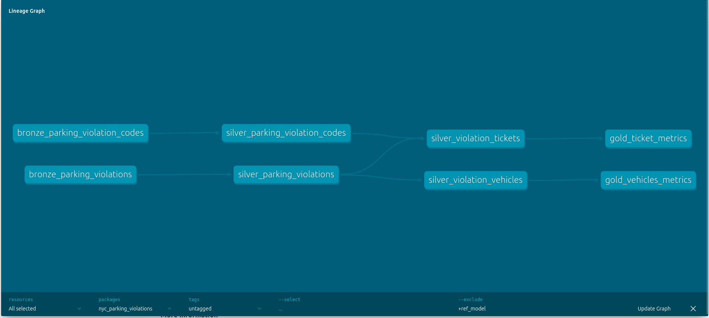

# NYC Parking Violations Data Project using Medallion Architecture

## Overview

This project applies the Medallion Architecture to NYC Parking Violations Data, leveraging the Data Build Tool (dbt) to create an efficient and scalable data pipeline. The project is organized into three layers—Bronze, Silver, and Gold—each serving a specific purpose in the data processing workflow.

## Architecture Layers

### Bronze Layer
- **NYC Violations Codes Raw Data**: Raw data view containing violation codes.
- **NYC Parking Violations Raw Data**: Raw data view containing parking violations.

### Silver Layer
- **NYC Violations Codes Cleaned Data**: Ephemeral model for cleaned violation codes data.
- **NYC Parking Violations Cleaned Data**: Ephemeral model for cleaned parking violations data.
- **Violation Ticket Data**: Transformed view representing violation ticket data.
- **Violation Vehicle Data**: Transformed view representing vehicle-related violation data.

### Gold Layer
- **Violation Ticket Metrics**: Materialized table containing key metrics related to violation tickets.
- **Violation Vehicle Metrics**: Materialized table containing key metrics related to vehicles involved in violations.

## Learning and Skills Development

This project is the culmination of skills and techniques learned from two LinkedIn Learning courses:

1. **Data Engineering with dbt** 
2. **Data Engineering: dbt for SQL** 

### Skills Applied:
- **Data Engineering**
- **Data Build Tool (dbt)**
- **SQL Optimization**
- **Medallion Architecture Implementation**

The courses provided a strong foundation in using dbt to manage SQL code effectively, design complex models, and perform SQL unit tests.

## Project Insights

The project demonstrates how to apply the Medallion Architecture to a real-world dataset, creating a structured and efficient data pipeline. By progressing through the Bronze, Silver, and Gold layers, the data undergoes a series of transformations that improve quality, consistency, and usability.

## Next Steps

I'm excited to continue exploring data engineering challenges using dbt and the Medallion Architecture. Feel free to reach out if you'd like to discuss this project or share insights on similar topics.

## Connect

If you're interested in dbt, data engineering, or discussing the Medallion Architecture, I'd love to connect and share insights!

